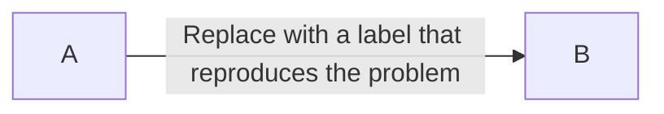

<!-- Target dev. Keep the PR focused and remove sections that do not apply.
Keep the contribution scope and AI assistance and ownership sections for every PR. -->

## Contribution scope

Fixes to the plugin itself and dependency updates are welcome. Fixes for bugs in
Mermaid itself belong upstream. PRs that patch Mermaid or add new plugin-side
workarounds for its bugs will be rejected, even if the workaround works.
Maintaining existing workarounds needed for the plugin to function is in scope.
Those workarounds are not a precedent for adding new upstream bug patches.
See [CONTRIBUTING.md](https://github.com/SmolBlackHole/mermaid-elk-renderer/blob/dev/CONTRIBUTING.md) for the project scope.

- [ ] This PR changes the plugin itself or updates dependencies. It does not patch Mermaid or add a new plugin-side workaround for an upstream Mermaid bug.

## AI assistance and ownership

Did you use AI assistance? Choose one, including help with the PR description:

- [ ] I did not use AI assistance for this PR.
- [ ] I used AI assistance for this PR and filled in the details below.

If you used AI, include:

- Model and version:
- Generation date:
- Generated content:
- Changes you made to the generated content:

<!-- Complete these confirmations for every PR, whether or not AI was used. -->

- [ ] I have reviewed all submitted changes, including generated code, tests, documentation, and PR text.
- [ ] I understand the changes and can explain how they work, why they are needed, and their tradeoffs.
- [ ] I take responsibility for the correctness of this contribution and the claims made in this PR.

## What changed?

<!-- Describe the problem, the fix, and any related issue. -->

## Reproduction

<!-- For rendering changes, replace this sample with the smallest diagram that
reproduces the problem. List the steps and settings needed to trigger it.
Use invented labels, not private note contents. -->



Steps and relevant plugin settings:

1. Describe the steps needed to reproduce the problem.

## Before and after

<!-- Attach before/after screenshots of the same diagram, using the same theme,
zoom, and settings. For nonvisual changes, describe the observed and expected
behavior instead. -->

**Before:**

**After:**

## Test environment

<!-- For rendering changes, fill in the environment for each comparison.
Include zoom, display scaling, and fonts if they affect the result. -->

- Plugin version / commit before and after:
- Obsidian version:
- Operating system and version:
- Mermaid provider: Obsidian built-in / plugin bundled / other
- Use bundled Mermaid 11: enabled / disabled
- Mermaid version for each provider tested (if unknown, say so):
- Browser version and reproducible URL (if tested outside Obsidian):
- Zoom / display scaling / fonts (if relevant):

Debug report (if applicable):

<!-- In plugin settings, use Support -> Copy debug report. Do not include
private note contents. -->

```text

```

## Validation

<!-- Check only what you actually ran. Explain failed or skipped checks below.
For bug fixes, add a regression test or explain why an automated test is not feasible. -->

- [ ] `npm audit`
- [ ] `npm test`
- [ ] `npm run lint -- --max-warnings=0`
- [ ] `npm run build`
- [ ] Tested in an Obsidian test vault with built-in Mermaid
- [ ] Tested in an Obsidian test vault with bundled Mermaid

Regression test and any failed or skipped checks:
