# Mermaid Elk Renderer Test

Test cases for the Mermaid Elk Renderer plugin combined with Mermaid's built-in
mindmap renderer. Covers hierarchy depth, branching width, node shapes,
markdown in labels, icons, classes, and the layout config override behaviour.

## Important: plugin interaction

The `mermaid-elk-renderer` plugin overwrites each `layout:` value in YAML
frontmatter with `layout: "elk"` as long as `overrideExistingLayout` is
`true`, which is the default. Mermaid mindmaps support their own layout
algorithms like `tidy-tree`. Without the `%% elk %%` marker, and with
`applyElkToAllDiagrams` off, the plugin leaves the diagram alone.

To keep `layout: tidy-tree` on a mindmap, turn off **Override existing
layout** in plugin settings, or omit the `%% elk %%` marker.

### With `%% elk %%` marker → `layout: "elk"` (plugin active)

```mermaid
%% elk %%
---
config:
  layout: tidy-tree
---
mindmap
root((Root))
  A
  B
  C
```

### Without marker → `layout: tidy-tree` preserved (plugin inactive)

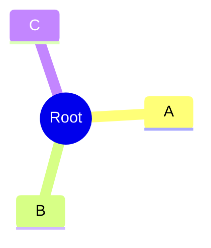

### Without frontmatter → plugin inactive, Mermaid default layout


## Basic: simple hierarchy (Mermaid default)


## Two levels

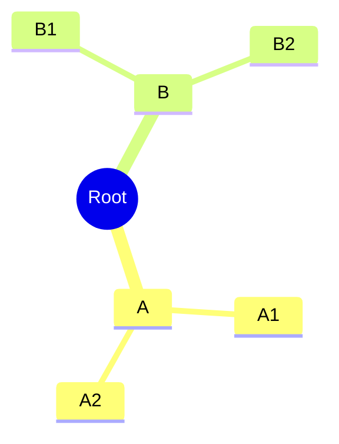

## Deep nesting (4 levels)

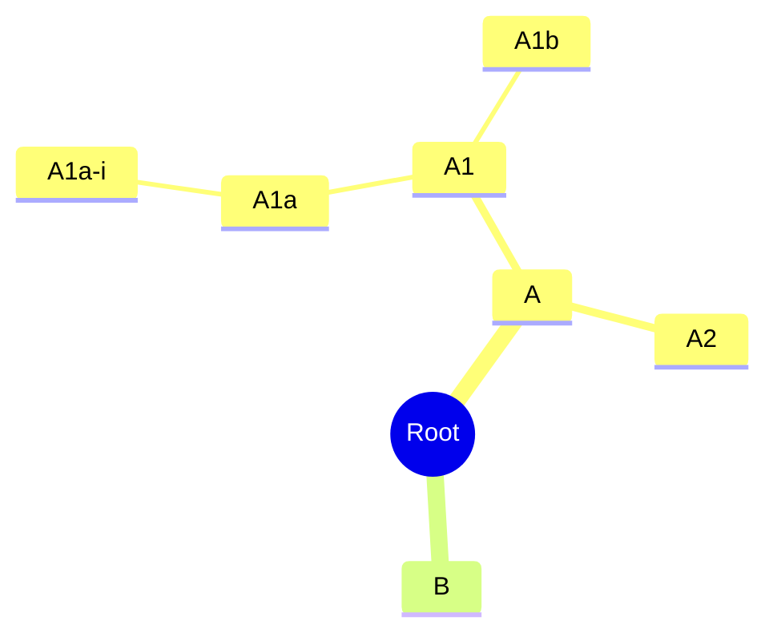

## Wide branching (10 children)

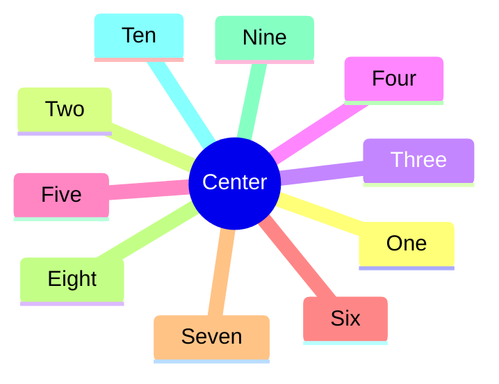

## Different node shapes

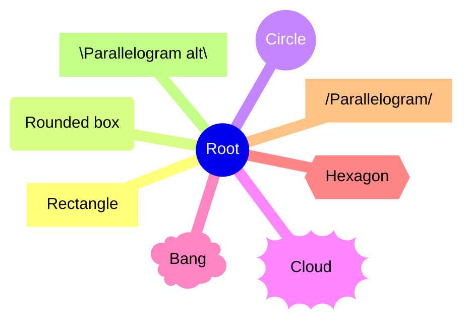

## Mixed shapes with children

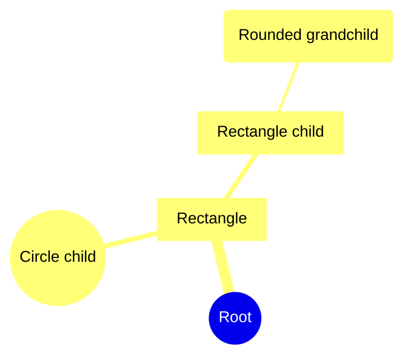

## Long text and line breaks

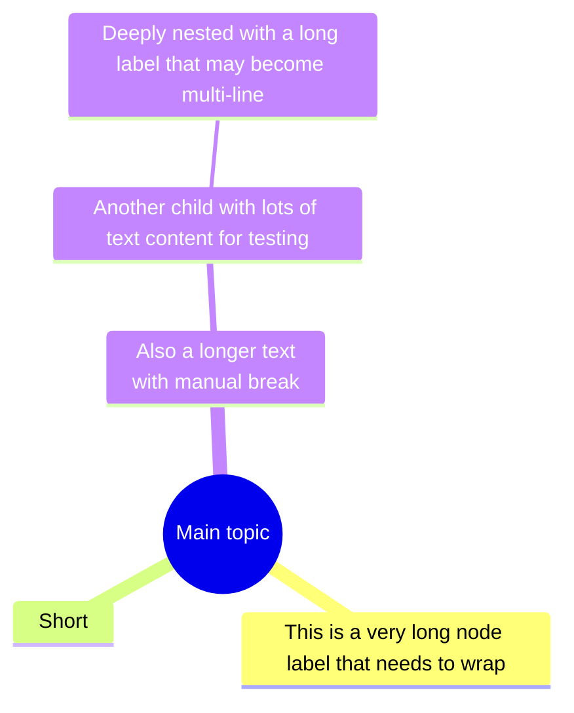

## Icons and emoji

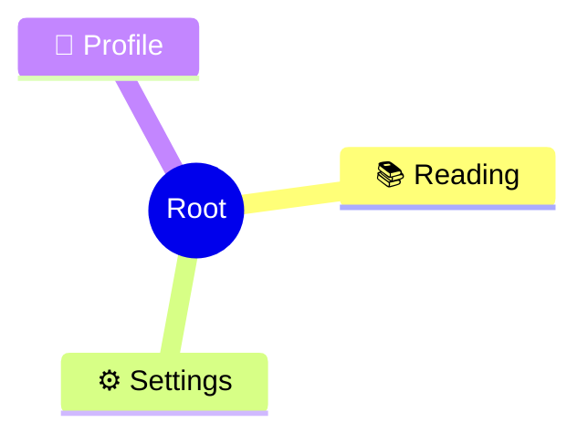

## Class syntax


## Markdown in labels

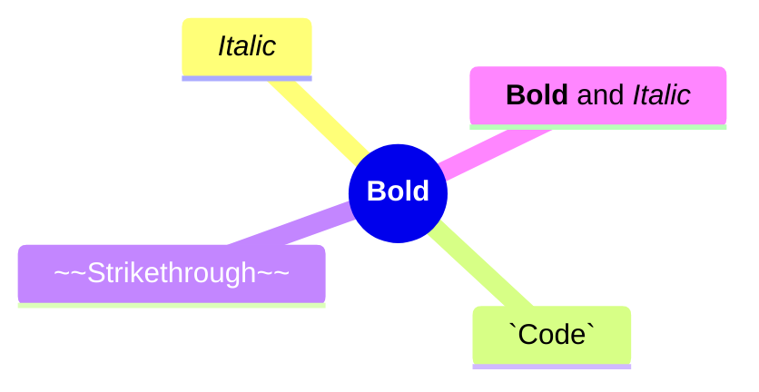

## Empty subtrees and single children

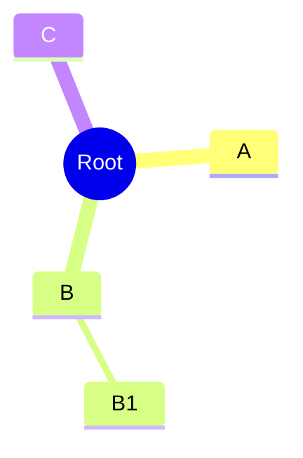

## Maximum test structure (everything combined)

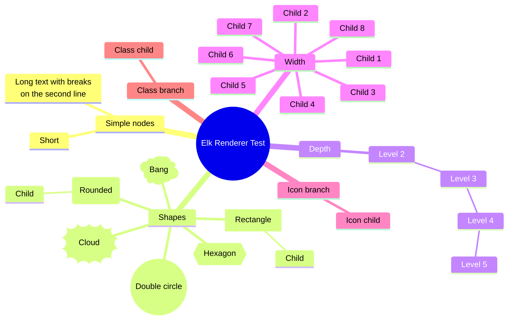

## Maximum test structure with tidy-tree layout (without `%% elk %%`)


## Same as above with tidy-tree layout (with `%% elk %%`)

```mermaid
%% elk %%
---
config:
  layout: tidy-tree
---
mindmap
root((Elk Renderer Test))
  Simple nodes
    Short
    Long text with breaks<br>on the second line
  Shapes
    [Rectangle]
      Child
    (Rounded)
      Child
    ((Double circle))
    ))Cloud((
    )Bang(
    {{Hexagon}}
  Depth
    Level 2
      Level 3
        Level 4
          Level 5
  Width
    Child 1
    Child 2
    Child 3
    Child 4
    Child 5
    Child 6
    Child 7
    Child 8
  ::icon(fa fa-star)
  Icon branch
    Icon child
  :::urgent
  Class branch
    Class child
```
