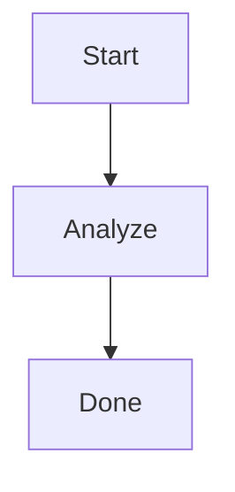

# Mermaid ELK Renderer

Re-enables the ELK (Eclipse Layout Kernel) renderer for Mermaid diagrams in Obsidian.

## What it does

- Registers ELK layouts through `@mermaid-js/layout-elk`.
- Keeps default Mermaid behavior for regular diagrams.
- Enables ELK per diagram with the marker `%% elk %%` at the top of a `mermaid` code block.

Example:



## Development

Prerequisites:

- Node.js 18+

Install and build:

```bash
npm install
npm run build
```

Build output files used by Obsidian:

- `main.js`
- `manifest.json`
- `styles.css` (optional, currently included)

## Install for local testing

1. Copy this plugin folder into your vault under `.obsidian/plugins/mermaid-elk-renderer`.
2. In Obsidian, enable Community plugins and then enable Mermaid ELK Renderer.

## Release process

1. Bump `version` in `manifest.json` and `package.json` using semantic versioning (`x.y.z`).
2. Update `versions.json` with `"<version>": "<minAppVersion>"`.
3. Run `npm run build`.
4. Create a GitHub Release with a tag matching `manifest.json` version.
5. Upload release assets:
   - `main.js`
   - `manifest.json`
   - `styles.css` (if used)

## Submission to Obsidian Community Plugins

Follow:

- https://docs.obsidian.md/Plugins/Releasing/Submit+your+plugin
- https://docs.obsidian.md/Plugins/Releasing/Submission+requirements+for+plugins
- https://docs.obsidian.md/Developer+policies

Before submission, ensure:

- `description` is short, clear, <= 250 chars, and ends with a period.
- `minAppVersion` matches real compatibility.
- `fundingUrl` is only present if it points to donation/sponsorship services.
- `isDesktopOnly` is set correctly based on APIs used.
