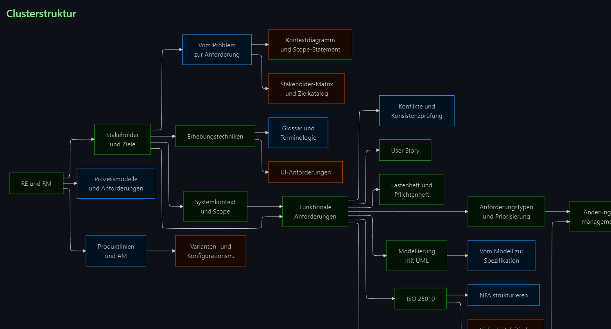
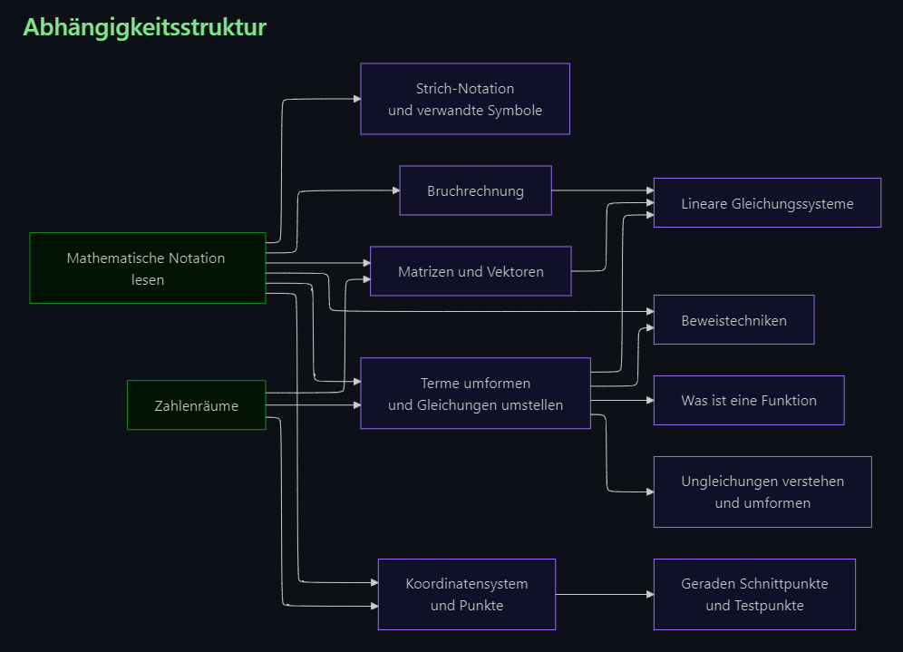

# Mermaid ELK Renderer

Re-enables the ELK (Eclipse Layout Kernel) renderer for Mermaid diagrams in Obsidian.

## Features

- Registers ELK layouts via `@mermaid-js/layout-elk`.
- Keeps default Mermaid behavior for all other diagrams unchanged.
- Enables ELK only where `%% elk %%` is set, on a per-diagram basis.
- Preserves custom `classDef` styling.
- Respects Obsidian's light and dark mode color scheme.

## Screenshots





## Installation

### Via Community Plugins

1. Open Obsidian Settings and go to **Community Plugins**.
2. Search for **Mermaid ELK Renderer** and install it.
3. Enable the plugin.
4. Restart Obsidian so the ELK renderer patch is fully applied.
5. After restarting, verify the plugin is still shown as enabled under Community Plugins.

> [!warning]
> A restart is required after enabling the plugin. Without it, the ELK renderer patch is not applied and `%% elk %%` diagrams will not render correctly.

### Manual Installation

> [!info]
> Use this method if the plugin is not yet listed in the Community Plugins directory.

1. Download the latest release: `main.js`, `manifest.json`, and `styles.css`.
2. Open Obsidian Settings and go to **Community Plugins**.
3. At the bottom of the installed plugins list, click the folder icon on the right. This opens the plugins folder in your file explorer.
4. Create a new folder named `mermaid-elk-renderer` inside that folder.
5. Copy `main.js`, `manifest.json`, and `styles.css` into it.
6. Restart Obsidian, then enable **Mermaid ELK Renderer** under Community Plugins.
7. Restart Obsidian once more and verify the plugin is still shown as enabled.

## Usage

Add `%% elk %%` at the top of any `mermaid` code block to use the ELK renderer for that diagram.

````markdown

````

Custom `classDef` styling works as expected:

````markdown

````

> [!tip]
> All diagrams without `%% elk %%` continue to use the default Mermaid renderer. You can mix ELK and non-ELK diagrams freely in the same vault.

## License

[MIT](LICENSE)
