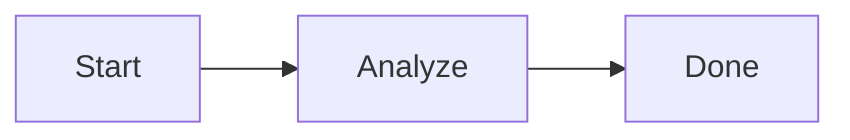
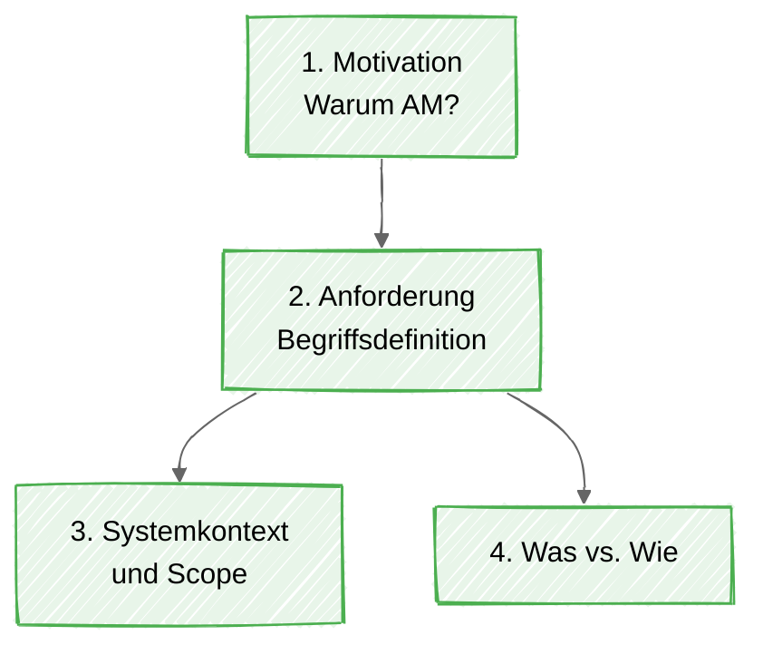

# Mermaid ELK Renderer

Re-enables the ELK (Eclipse Layout Kernel) renderer for Mermaid diagrams in Obsidian.

If you ever looked at a Mermaid graph and thought, "this could use more layout engine and slightly more chaos," this plugin is for you.

## What it does

- Registers ELK layouts via `@mermaid-js/layout-elk`.
- Enables ELK only where `%% elk %%` is present, unless you explicitly route all diagrams through ELK.
- Can optionally render through bundled Mermaid 11 when Obsidian's built-in Mermaid is too old for newer diagram types.
- Preserves existing frontmatter, so things like `theme: neutral` or `look: handDrawn` still work.
- Adds guardrails for common Mermaid label edge cases, because users are creative and regexes are patient.

## Mermaid docs

If you want the full Mermaid feature set, syntax, and examples, start here:

- [Mermaid introduction](https://mermaid.js.org/intro/)

## What it does not do

- It does not magically make Obsidian's built-in Mermaid support every new Mermaid feature except if you enable the bundled Mermaid 11 option.
- It does not phone home.
- It does not judge your diagrams. Much.

By default, this plugin keeps using Obsidian's Mermaid instance and only injects `config.layout: "elk"` for routed diagrams.

If you enable **Use bundled Mermaid 11**, the plugin renders through Mermaid `11.15.0` bundled with the plugin instead. That is useful for newer diagram types such as `treemap-beta` when Obsidian's built-in Mermaid is behind.

## Installation

### Via Community Plugins

1. Open **Settings -> Community plugins**.
2. Search for **Mermaid ELK Renderer**.
3. Install and enable it.

### Manual installation

1. Download the latest `main.js`, `manifest.json`, and `styles.css` from the release.
2. Open your vault's plugin folder.
3. Create a folder named `mermaid-elk-renderer`.
4. Copy the three files into that folder.
5. Enable the plugin in Obsidian.

## Basic usage

Add `%% elk %%` near the top of any Mermaid block:

````markdown

```mermaid
%% elk %%
flowchart LR
    A[Start] --> B[Analyze]
    B --> C[Done]
```
````

## `handDrawn` example

Frontmatter is preserved, so Mermaid config like `look: handDrawn` and `theme: neutral` can be used together with ELK:

````markdown

```mermaid
---
config:
  look: handDrawn
  theme: neutral
---
%% elk %%
flowchart TD
  M["1. Motivation<br/>Warum AM?"]
  AD["2. Anforderung<br/>Begriffsdefinition"]
  SK["3. Systemkontext<br/>und Scope"]
  WV["4. Was vs. Wie"]

  M --> AD
  AD --> SK
  AD --> WV

  style M fill:#e8f5e9,stroke:#4caf50
  style AD fill:#e8f5e9,stroke:#4caf50
  style SK fill:#e8f5e9,stroke:#4caf50
  style WV fill:#e8f5e9,stroke:#4caf50
```
````

A small Mermaid quirk worth knowing:

- `look: handDrawn` affects the general drawing style.
- Explicit `style ... fill:... stroke:...` rules still apply strongly.
- So if some nodes look less sketchy than expected, that is usually Mermaid styling behavior, not the ELK patch trying to ruin your day.

## Settings

Open **Settings -> Community plugins -> Mermaid ELK Renderer**.

### General

- **Debug logging**: enables local debug logs in the developer console.
- **Escape numbered labels**: prevents labels like `1. Step` from being interpreted as Markdown lists by Mermaid.
- **Apply elk to all diagrams**: routes every Mermaid diagram through ELK, even without the marker.
- **Override existing layout**: replaces an existing Mermaid `config.layout` value with `elk`.
- **Use bundled Mermaid 11**: uses bundled Mermaid `11.15.0` instead of Obsidian's Mermaid.

### Regex overrides

There is also a small expert section for regex overrides.

These defaults are already configured by the plugin, but you can tweak them if you hit a weird label edge case and feel like negotiating with regular expressions directly:

- **Ordered label regex**
- **Ordered label replacement**
- **Quoted label regex**
- **Bracket label regex**

The default replacement uses a zero-width-space strategy instead of a visible backslash, so labels like these should render normally:

- `4. Was vs. Wie`
- `6. Kano-Modell`
- `10. Rueckverfolgbarkeit`

If you change regex overrides, you are officially in "I know what I am doing" territory.

## Restart note

For reliable results, restart Obsidian after changing plugin settings.

Yes, the plugin does try to rerender previews immediately. Also yes, Obsidian plugin lifecycles can still be dramatic.

## Support

The settings page includes a **Support** section with:

- a repository link
- an issue tracker link
- a **Copy debug report** button

### Reporting bugs

When opening an issue, use **Copy debug report** first and paste the result into the GitHub issue template.

The plugin keeps logs locally in memory and does not upload them anywhere. You choose what to share.

Repository:

- [GitHub repository](https://github.com/SmolBlackHole/mermaid-elk-renderer)
- [Issue tracker](https://github.com/SmolBlackHole/mermaid-elk-renderer/issues/new/choose)

## Development structure

The plugin is split into small modules:

- `main.ts` coordinates plugin lifecycle, settings, and report generation.
- `settings.ts` renders the Obsidian settings UI.
- `settings-data.ts` defines settings, defaults, and normalization.
- `renderer.ts` contains pure Mermaid source transformation logic.
- `mermaid-provider.ts` selects Obsidian Mermaid or bundled Mermaid.
- `renderer-patch.ts` installs and restores the Mermaid proxy.
- `preview-refresh.ts` rerenders open Markdown previews.
- `logger.ts` stores recent logs and drives the debug report.

## License

[MIT](LICENSE)
