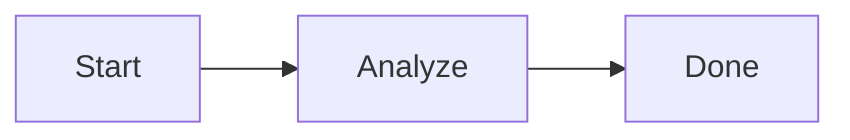
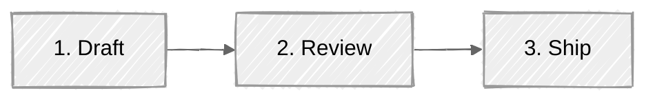
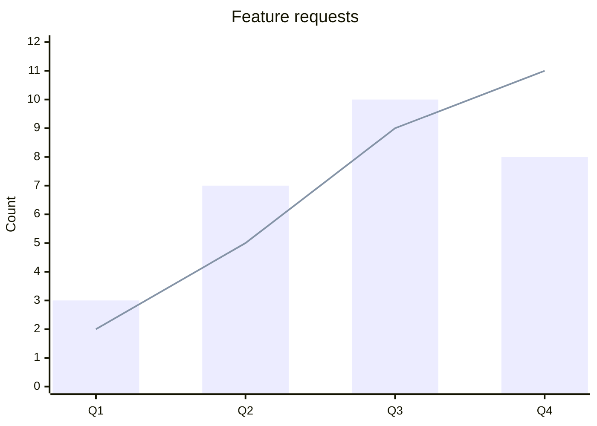
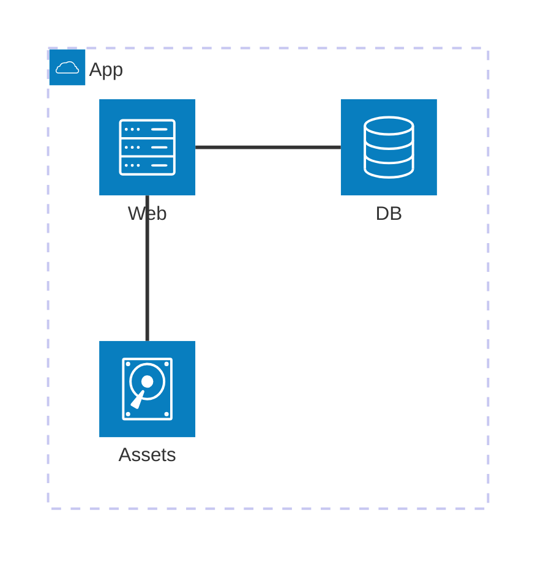

# Mermaid ELK Renderer

Re-enables the ELK (Eclipse Layout Kernel) renderer for Mermaid diagrams in Obsidian.

If you ever looked at a Mermaid graph and thought, "this could use more layout engine and slightly more chaos," this plugin is for you.

## What this plugin does

- Registers ELK layouts via `@mermaid-js/layout-elk`.
- Enables ELK only where `%% elk %%` is present, unless you explicitly route all diagrams through ELK.
- Can optionally render through bundled Mermaid 11 when Obsidian's built-in Mermaid is too old for newer diagram types.
- Preserves existing frontmatter, so things like `theme: neutral` or `look: handDrawn` still work.
- Adds guardrails for common Mermaid label edge cases, because users are creative and regexes are patient.

> [!important] Bundled Mermaid 11 loads a newer Mermaid version
> If you enable **Use bundled Mermaid 11**, this plugin loads Mermaid `11.15.0` from the plugin itself instead of Obsidian's older bundled Mermaid.
> This is the switch to flip if examples from the official Mermaid docs work there but not in stock Obsidian.
> Official Mermaid docs: [Mermaid introduction](https://mermaid.js.org/intro/)
> [!tip] Start simple
> In most cases you only need one thing: add `%% elk %%` to the diagram you want to route through ELK.
>
> > [!question] Need more control later?
> > Check the advanced settings guide in [docs/advanced-settings.md](docs/advanced-settings.md).

## Installation

### Via Community Plugins

1. Open **Settings -> Community plugins**.
2. Search for **Mermaid ELK Renderer**.
3. Install and enable it.

### Manual installation

1. Download the latest `main.js`, `manifest.json`, and `styles.css` from the release.
2. Open your vault's plugin folder.
3. Create a folder named `mermaid-elk-renderer`.
4. Copy the three files into that folder.
5. Enable the plugin in Obsidian.

## Quick start

Add `%% elk %%` near the top of any Mermaid block:

````markdown

```mermaid
%% elk %%
flowchart LR
    A[Start] --> B[Analyze]
    B --> C[Done]
```
````

That is enough to get ELK layout on that diagram.

## Small examples

> [!info] Why these are images
> The diagrams below are prerendered SVGs.
> The raw Mermaid source only works live when the plugin is enabled, **Use bundled Mermaid 11** is on, and the `%% elk %%` marker routes the diagram through the plugin.

<!-- markdownlint-disable MD033 -->
<details>
<summary>ELK flowchart</summary>


````markdown

```mermaid
---
config:
  look: handDrawn
  theme: neutral
---
%% elk %%
flowchart LR
    Draft["1. Draft"] --> Review["2. Review"]
    Review --> Ship["3. Ship"]
```
````

</details>

<details>
<summary>Mermaid 11 XY chart</summary>


````markdown

```mermaid
%% elk %%
xychart-beta
    title "Feature requests"
    x-axis [Q1, Q2, Q3, Q4]
    y-axis "Count" 0 --> 12
    bar [3, 7, 10, 8]
    line [2, 5, 9, 11]
```
````

</details>

<details>
<summary>Mermaid 11 architecture diagram</summary>


````markdown

```mermaid
%% elk %%
architecture-beta
    group app(cloud)[App]

    service web(server)[Web] in app
    service db(database)[DB] in app
    service disk(disk)[Assets] in app

    web:R -- L:db
    disk:T -- B:web
```
````

</details>
<!-- markdownlint-enable MD033 -->

> [!example] Want more than the tiny version?
> Open the Mermaid 11 showcase page in [docs/mermaid-11-examples.md](docs/mermaid-11-examples.md).

## Everyday tips

> [!tip] Use per-diagram routing first
> Keep `Apply elk to all diagrams` off until you know you want ELK everywhere.
> [!example] Mermaid config is preserved
> Existing frontmatter such as `look: handDrawn` or `theme: neutral` stays intact when the plugin injects `layout: "elk"`.
> [!warning] Restart note
> The plugin tries to rerender previews immediately after changes.
> A full Obsidian restart is still the cleanest reset after changing plugin settings. This is a limitation of how Mermaid and Obsidian's rendering pipeline work.

## Settings

Open **Settings -> Community plugins -> Mermaid ELK Renderer**.

The most important options are:

- **Debug logging**: enables local debug logs in the developer console.
- **Escape numbered labels**: prevents labels like `1. Step` from being interpreted as Markdown lists by Mermaid.
- **Apply elk to all diagrams**: routes every Mermaid diagram through ELK, even without the marker.
- **Override existing layout**: replaces an existing Mermaid `config.layout` value with `elk`.
- **Use bundled Mermaid 11**: uses bundled Mermaid `11.15.0` instead of Obsidian's Mermaid.
- **Default Mermaid look** and **Default Mermaid theme**: set global defaults for routed diagrams without overwriting diagram-specific frontmatter.

> [!tip] Looking for newer Mermaid features?
> Turn on **Use bundled Mermaid 11**.
> That makes the plugin load the newer Mermaid runtime from the plugin and is the option most people want when they are following the official Mermaid docs.
> Docs: [mermaid.js.org/intro](https://mermaid.js.org/intro/)
> [!danger] Danger zone
> The regex overrides are for real edge cases.
> If your diagrams already render correctly, leave that section alone and enjoy your day.
> If they do not, open an issue: [github.com/SmolBlackHole/mermaid-elk-renderer/issues](https://github.com/SmolBlackHole/mermaid-elk-renderer/issues)

## Mermaid docs

If you want the full Mermaid feature set, syntax, and examples, start here:

- [Mermaid introduction](https://mermaid.js.org/intro/)

## More docs

- [Advanced settings and examples](docs/advanced-settings.md)
- [Mermaid 11 example renders](docs/mermaid-11-examples.md)
- [Support, bug reports, and debug reports](docs/support.md)
- [Development notes](docs/development.md)

## What it does not do

- It does not magically make Obsidian's built-in Mermaid support every new Mermaid feature unless you enable bundled Mermaid 11.
- It does not phone home.
- It does not judge your diagrams. Much.

## License

[MIT](LICENSE)
