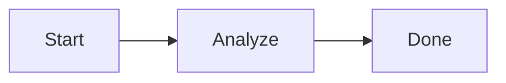
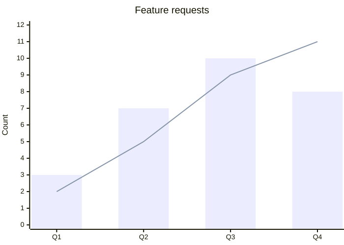

# Mermaid ELK Renderer

Re-enables the ELK (Eclipse Layout Kernel) layout engine for Mermaid diagrams in Obsidian.


## What this plugin does

- Adds `%% elk %%` marker support. Put the marker inside any Mermaid block and that diagram gets ELK layout.
- Can optionally load Mermaid 11.16.0 from the plugin instead of Obsidian's older built-in Mermaid. This is the switch for newer diagram types like `xychart-beta`, `cynefin-beta`, or `railroad-beta`.
- Preserves your existing frontmatter. `look: handDrawn`, `theme: neutral`, and other config values stay intact.

> [!tip] Start simple
> Add `%% elk %%` to a diagram. That is usually all you need.
>
> > [!question] Want more control?
> > See [docs/advanced-settings.md](docs/advanced-settings.md).

## Quick start

Add `%% elk %%` inside any Mermaid block and that diagram gets ELK layout:

````markdown

```mermaid
%% elk %%
flowchart LR
    A[Start] --> B[Analyze]
    B --> C[Done]
```
````

> [!example]- Example renders
> Here is what ELK layout looks like compared to stock dagre:
>
> 
>
> ELK also works on newer diagram types when you enable bundled Mermaid 11:
>
>  
>
> [docs/mermaid-11-examples.md](docs/mermaid-11-examples.md) has a full showcase with prerendered images and copyable source snippets.

## Installation

### Community plugins

1. Open **Settings, Community plugins**.
2. Search for **Mermaid ELK Renderer**.
3. Install and enable.

### Manual

1. Download `main.js`, `manifest.json`, and `styles.css` from the latest GitHub release.
2. Create a folder named `mermaid-elk-renderer` in your vault's plugin folder.
3. Copy the three files in.
4. Enable the plugin.

## Settings

Open **Settings, Community plugins, Mermaid ELK Renderer**.

| Setting | What it does |
|---|---|
| **Debug logging** | Logs plugin activity to the developer console. **THIS DATA WILL NOT LEAVE YOUR DEVICE OR BE SENT OVER THE INTERNET** |
| **Use bundled Mermaid 11** | Load Mermaid 11.16.0 from the plugin. Turn this on when a diagram from the official Mermaid docs does not work in stock Obsidian. |
| **Apply elk to all diagrams** | Route every Mermaid diagram through ELK, marker or not. |
| **Override existing layout** | Replace an existing `config.layout` with `elk`. |
| **Escape numbered labels** | Prevent labels like `1. Step` from triggering Markdown list rendering inside Mermaid. |
| **Default Mermaid look / theme** | Set global look and theme defaults for routed diagrams. |

> [!warning] Restart after changing settings
> The plugin refreshes previews on change, but a full Obsidian restart is still the cleanest reset.

> [!danger] Danger zone
> The regex overrides in advanced settings are for real edge cases. If your diagrams already work, leave them alone. If they do not, [open an issue](https://github.com/SmolBlackHole/mermaid-elk-renderer/issues).

## More docs

- [Advanced settings](docs/advanced-settings.md)
- [Mermaid 11 example showcase](docs/mermaid-11-examples.md)
- [Support and debug reports](docs/support.md)
- [Development notes](docs/development.md)
- [Official Mermaid docs](https://mermaid.js.org/intro/)

## Try the examples in Obsidian

The [examples/](examples/) folder contains ready-to-use Markdown files. Copy them into your vault, enable the plugin, and open them in Obsidian to see the diagrams render live.

- `examples/Mermaid-11.16-layout-comparison.md` — dagre vs. elk side by side
- `examples/Mermaid-11.16-charts.md` — pie and XY chart
- `examples/Mermaid-11.16-cynefin-railroad.md` — cynefin framework and railroad diagrams
- `examples/Mermaid-11.16-er-state-arch-gantt.md` — ER, state, architecture, gantt, and tree view

## License

[MIT](LICENSE)
