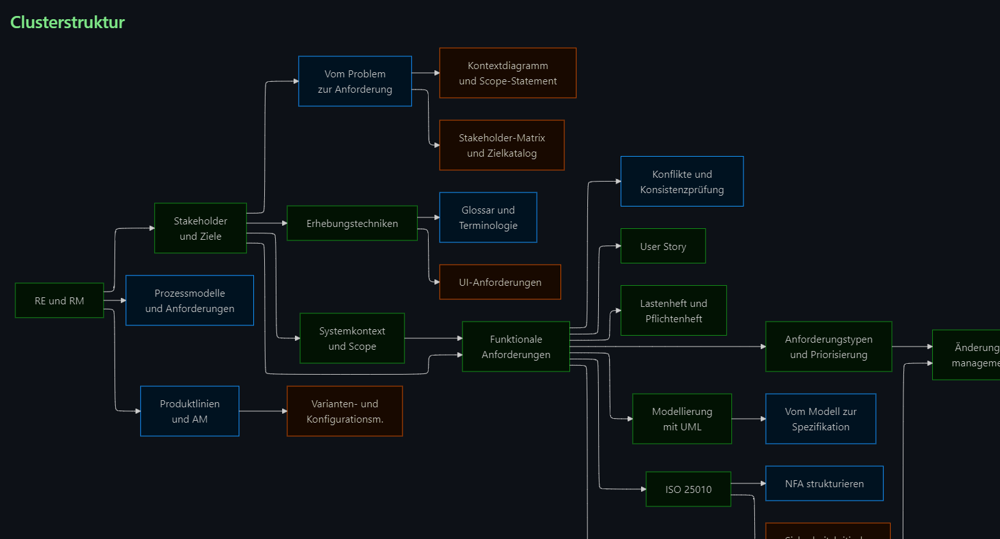
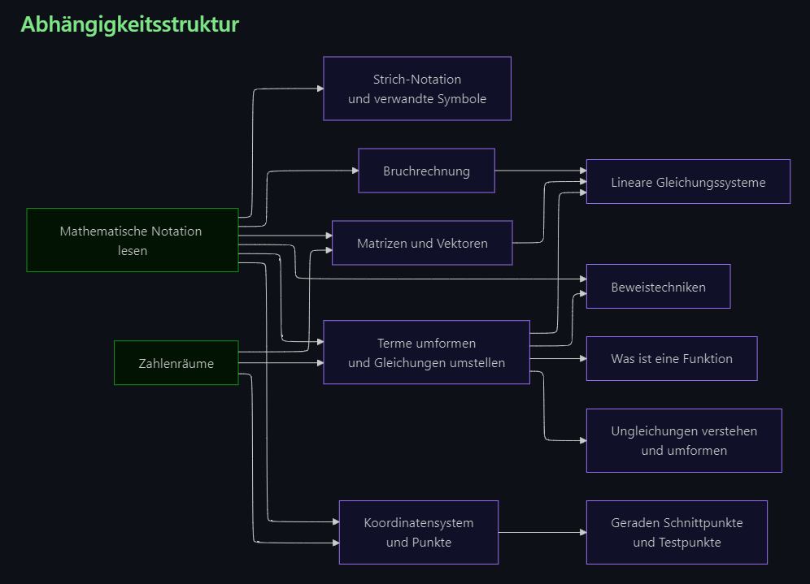

# Mermaid ELK Renderer

Re-enables the ELK (Eclipse Layout Kernel) renderer for Mermaid diagrams in Obsidian.

## Features

- Registers ELK layouts via `@mermaid-js/layout-elk`.
- Keeps default Mermaid behavior for all other diagrams unchanged unless the bundled Mermaid option is enabled.
- Can optionally render through a bundled experimental Mermaid 11 build.
- Enables ELK only where `%% elk %%` is set, on a per-diagram basis.
- Preserves custom `classDef` styling.
- Respects Obsidian's light and dark mode color scheme.

## What this plugin changes

By default, this plugin does not replace Obsidian's bundled Mermaid version. It only registers the ELK layout provider and routes diagrams marked with `%% elk %%` through Obsidian's existing Mermaid renderer with `config.layout` set to `elk`.

That means Mermaid syntax support still depends on the Mermaid version shipped with your Obsidian installation. New upstream Mermaid diagram types or syntax are not added by this plugin unless Obsidian already supports them.

An experimental setting can switch rendering to Mermaid 11 bundled with this plugin. This may enable newer upstream Mermaid diagram types before Obsidian ships them, but it can also behave differently from Obsidian's tested Mermaid version.

> [!info]
> Diagrams without `%% elk %%` are not forced through ELK. When the bundled Mermaid option is disabled, they continue to use Obsidian's default Mermaid rendering path.

## Screenshots





## Installation

### Via Community Plugins

1. Open Obsidian Settings and go to **Community Plugins**.
2. Search for **Mermaid ELK Renderer** and install it.
3. Enable the plugin.
4. Open a note with Mermaid diagrams. Open previews are refreshed automatically when the plugin loads.

### Manual Installation

> [!info]
> Use this method if the plugin is not yet listed in the Community Plugins directory.

1. Download the latest release: `main.js`, `manifest.json`, and `styles.css`.
2. Open Obsidian Settings and go to **Community Plugins**.
3. At the bottom of the installed plugins list, click the folder icon on the right. This opens the plugins folder in your file explorer.
4. Create a new folder named `mermaid-elk-renderer` inside that folder.
5. Copy `main.js`, `manifest.json`, and `styles.css` into it.
6. Enable **Mermaid ELK Renderer** under Community Plugins.

## Usage

Add `%% elk %%` at the top of any `mermaid` code block to use the ELK renderer for that diagram.

````markdown

```mermaid
%% elk %%
flowchart LR
    A[Start] --> B[Analyze]
    B --> C[Done]
```
````

Custom `classDef` styling works as expected:

````markdown

```mermaid
%% elk %%
flowchart LR
    A[Start] --> B[Process]

    classDef highlight fill:#e8f5e9,stroke:#4caf50;
    class A highlight;
```
````

> [!tip]
> Diagrams without `%% elk %%` continue to use the default Mermaid layout. You can mix ELK and non-ELK diagrams freely in the same vault.

## Settings

Open **Settings** -> **Community plugins** -> **Mermaid ELK Renderer** to configure the plugin.

- **Debug logging** logs plugin startup, renderer patching, and ELK routing decisions to the developer console.
- **Escape numbered labels** prevents labels like `1. Step` from being interpreted as Markdown lists by Mermaid.
- **Marker text** changes the text used inside the marker. The default marker is `%% elk %%`.
- **Apply ELK to all diagrams** routes every Mermaid diagram through ELK, even without the marker.
- **Override existing layout** replaces an existing Mermaid `config.layout` value with `elk` when a diagram is routed through this plugin.
- **Use bundled Mermaid 11** renders through Mermaid 11 bundled with this plugin instead of Obsidian's bundled Mermaid. This option is experimental.
- **Reset settings** restores all plugin settings to their defaults.

> [!info]
> Settings are applied immediately. The plugin refreshes open Markdown previews automatically after each settings change.

## Development

The plugin is split into small adapter modules:

- `main.ts` owns the Obsidian plugin lifecycle and coordinates settings, patching, and preview refreshes.
- `settings.ts` renders the Obsidian settings UI.
- `settings-data.ts` defines the settings model, defaults, and normalization.
- `renderer.ts` contains pure Mermaid source transformation logic.
- `mermaid-provider.ts` selects either Obsidian's Mermaid instance or the bundled experimental Mermaid build.
- `renderer-patch.ts` installs and restores the Mermaid proxy used for ELK routing.
- `preview-refresh.ts` refreshes open Markdown previews after plugin or settings changes.

## License

[MIT](LICENSE)
