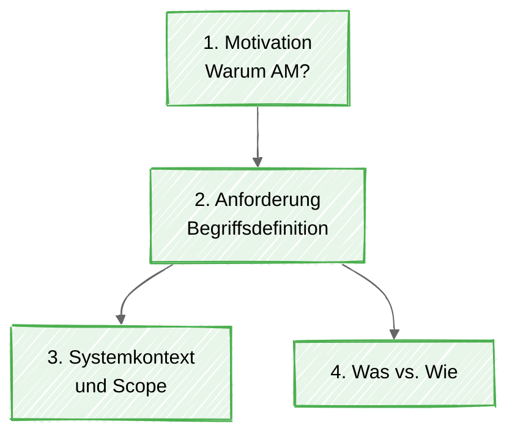

# Advanced settings and examples

Back to the main guide: [README](../README.md)

## Bundled Mermaid 11

By default, the plugin keeps using Obsidian's Mermaid instance and only injects `config.layout: "elk"` for routed diagrams.

If you enable **Use bundled Mermaid 11**, the plugin renders through Mermaid `11.15.0` bundled with the plugin instead. That is useful for newer diagram types such as `treemap-beta` when Obsidian's built-in Mermaid is behind.

> [!important] What this toggle really does
> **Use bundled Mermaid 11** makes the plugin load a newer Mermaid runtime from the plugin itself.
> In practice, this is the switch to use when you find a diagram in the official Mermaid docs and it does not work in plain Obsidian yet.
> Official Mermaid docs: [Mermaid introduction](https://mermaid.js.org/intro/)
> [!tip] When to turn this on
> Enable bundled Mermaid 11 if a diagram works in current Mermaid docs but fails in Obsidian's built-in renderer.
> [!example] Need something to test with
> Open [mermaid-11-examples.md](mermaid-11-examples.md) and try the showcase diagrams there.

## Styling defaults

The plugin can apply default Mermaid styling values to routed diagrams:

- **Default Mermaid look**
- **Default Mermaid theme**

These defaults are only added when the diagram does not already define them.
Your own frontmatter still wins.

### Example with preserved frontmatter

````markdown

````

Mermaid quirk worth knowing:

- `look: handDrawn` affects the general drawing style.
- Explicit `style ... fill:... stroke:...` rules still apply strongly.
- If some nodes look less sketchy than expected, that is usually Mermaid styling behavior.

## Danger zone: regex overrides

The regex defaults are already configured for common Mermaid label issues.
Only touch these if you hit a real edge case.

Available override fields:

- **Ordered label regex**
- **Ordered label replacement**
- **Quoted label regex**
- **Bracket label regex**

The default replacement uses a zero-width-space strategy instead of a visible backslash, so labels like these should render normally:

- `4. Was vs. Wie`
- `6. Kano-Modell`
- `10. Rueckverfolgbarkeit`

> [!danger] Practical advice
> If the diagram already works, do not improve it with regex.
> That road is paved with confidence and strange screenshots.

## Callouts in Obsidian docs and notes

Obsidian supports native callouts such as `info`, `tip`, `faq`, `question`, `failure`, `danger`, `bug`, and `example`.
Nested callouts are supported as well.

- [Obsidian callouts documentation](https://obsidian.md/help/callouts)
- [Mermaid introduction](https://mermaid.js.org/intro/)
