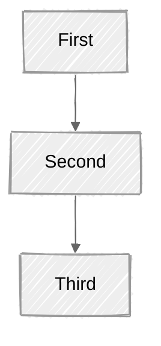

# Advanced settings

Back to the main guide: [README](../README.md)

## Bundled Mermaid 11

If you enable **Use bundled Mermaid 11**, the plugin loads Mermaid 11.17.0 from the plugin instead of using Obsidian's built-in Mermaid. This matters when you hit a diagram type that is documented at [mermaid.js.org](https://mermaid.js.org/intro/) but does not render in stock Obsidian.

> [!tip] When to turn this on
> If a diagram from the official Mermaid docs fails in Obsidian, try the bundled runtime first.

## Long labels getting cut off

Mermaid measures edge labels with a hidden measurement pass and clamps each label to a 200 px box. The layout engine then trusts that measurement. When the measurement lands on a sub-pixel fraction (fonts, display scaling and zoom can all cause this), Mermaid's built-in safety net — switch the label to word-wrapping when it fills the 200 px box — fails a strict equality check. The label then stays on one line, overflows its box, and the tail of the text is cut off mid-character. Long CJK labels hit this first because every character is a full glyph width.

Obsidian ships a manual fix for this in their own bundled Mermaid. The plugin applies the same one-line fix to the Mermaid runtime it bundles, so the bundled path wraps long labels instead of truncating them. This is a build-time patch (`scripts/lib/mermaid-wrap-switch-patch.mjs`); if a future Mermaid upgrade changes the bundled code shape, the build fails loudly instead of silently dropping the fix.

Nothing to configure — routed diagrams wrap long labels automatically.

## Styling defaults

**Default Mermaid look** and **Default Mermaid theme** set global defaults for routed diagrams. They only apply when the diagram does not already define its own values. Your own frontmatter always wins.

````markdown

```mermaid
---
config:
  look: handDrawn
  theme: neutral
---
%% elk %%
flowchart TD
    A[First] --> B[Second]
    B --> C[Third]
```
````

A few things worth knowing:

- `look: handDrawn` changes the overall drawing style.
- Explicit `style ... fill:... stroke:...` rules can make some nodes look less sketchy than others. That is normal Mermaid behavior.
- Elk layout works on graph based types: `flowchart`, `classDiagram`, `erDiagram`, `stateDiagram`, `block-beta`.

## Mindmaps and ELK

Mindmaps support their own layout algorithms like `tidy-tree`. The plugin overrides `config.layout` with `elk` by default when it processes a diagram. For mindmaps this is usually the wrong call. ELK is a graph layout engine, not a tree layout engine.

If your mindmap uses `layout: tidy-tree`, either turn off **Override existing layout** in settings, or leave out the `%% elk %%` marker so the plugin skips it.

## Danger zone: regex overrides

The regex defaults handle common Mermaid label issues. Only touch these if you hit a real edge case.

The default replacement uses a zero-width-space strategy so labels like `4. Was vs. Wie` or `10. Traceability` render normally.

> [!danger] Practical advice
> If the diagram already works, leave the regex fields alone. That road is paved with short-term confidence and screenshots you will later delete.
