# Mermaid 11 example renders

Back to the main guide: [README](../README.md)

> [!info] Prerendered showcase
> These diagrams are prerendered for GitHub and plain Markdown viewers.
> To see them live in Obsidian, enable **Use bundled Mermaid 11** (loads Mermaid `11.16.0`).
> Official Mermaid docs: [mermaid.js.org](https://mermaid.js.org/intro/)
>
> Want copy-paste Markdown files? Grab them from the [examples/](../examples/) folder and open them in your vault.

## Architecture diagram

<!-- markdownlint-disable MD033 -->
<details>
<summary>API group with web server, database, and cache services.</summary>

> [!important] Bundled Mermaid required
> This diagram type needs **Use bundled Mermaid 11** enabled.


````markdown
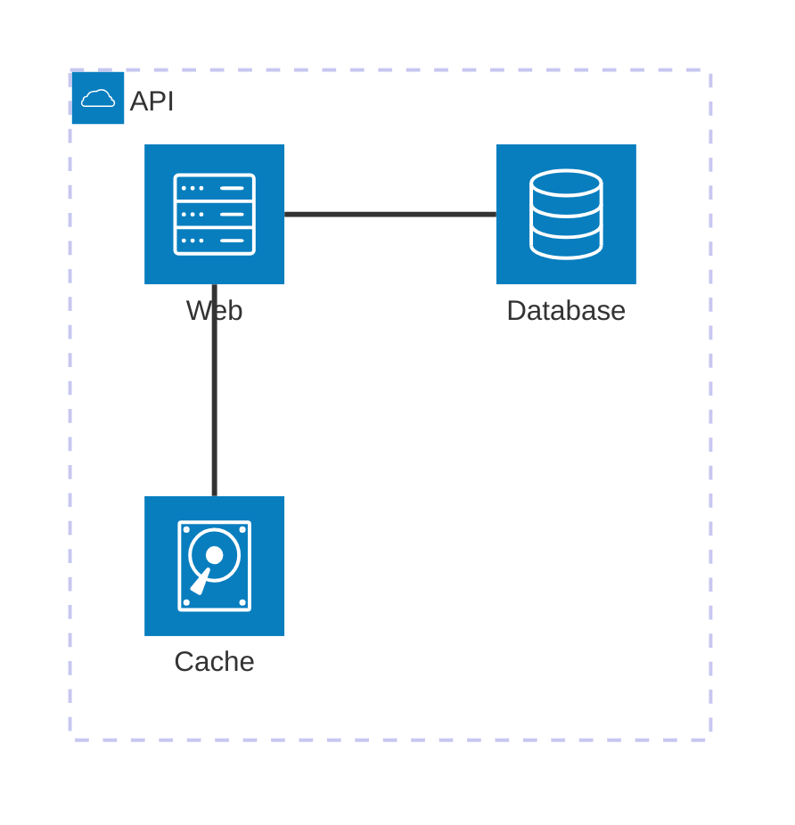
````

</details>
<!-- markdownlint-enable MD033 -->

## XY chart

<!-- markdownlint-disable MD033 -->
<details>
<summary>Release activity tracked as bar and line chart over six months.</summary>

> [!important] Bundled Mermaid required
> This diagram type needs **Use bundled Mermaid 11** enabled.

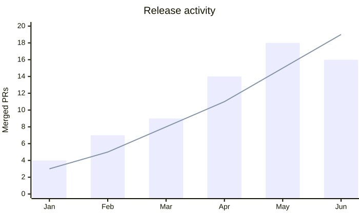

````markdown
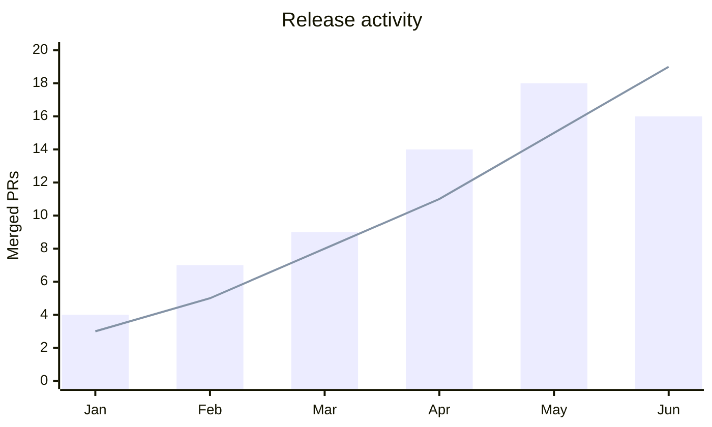
````

</details>
<!-- markdownlint-enable MD033 -->

## Treemap diagram

<!-- markdownlint-disable MD033 -->
<details>
<summary>Work breakdown for the plugin by area.</summary>

> [!important] Bundled Mermaid required
> This diagram type needs **Use bundled Mermaid 11** enabled.

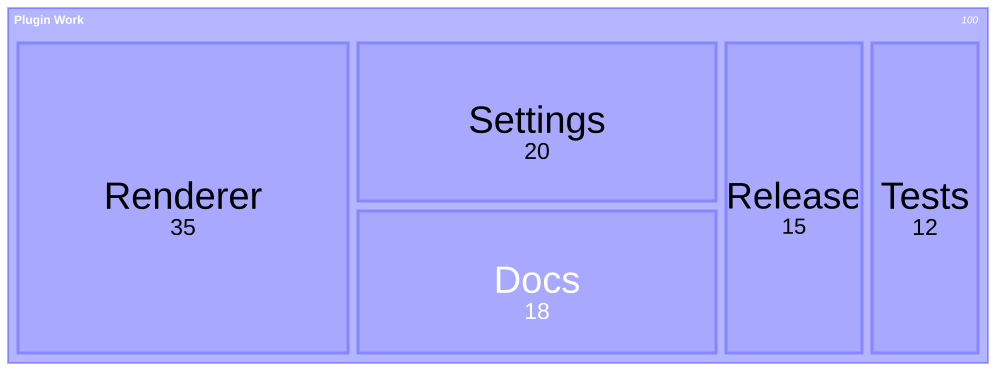

````markdown
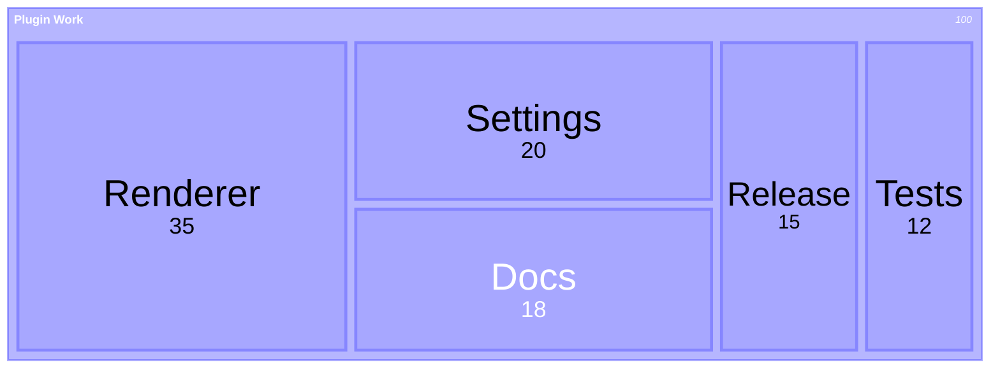
````

</details>
<!-- markdownlint-enable MD033 -->

## Packet diagram

<!-- markdownlint-disable MD033 -->
<details>
<summary>UDP packet layout showing port, length, checksum, and data fields.</summary>


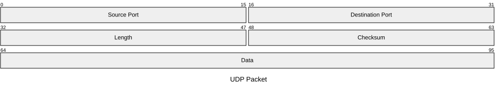

````markdown
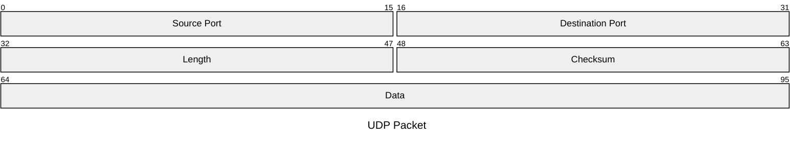
````

</details>
<!-- markdownlint-enable MD033 -->

## Radar diagram

<!-- markdownlint-disable MD033 -->
<details>
<summary>Grade comparison between two students across six subjects.</summary>

> [!important] Bundled Mermaid required
> This diagram type needs **Use bundled Mermaid 11** enabled.

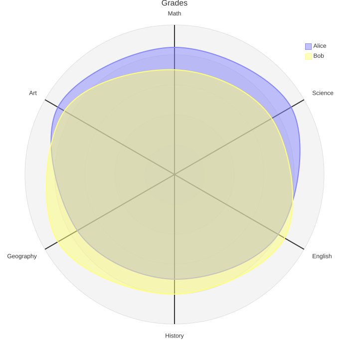

````markdown
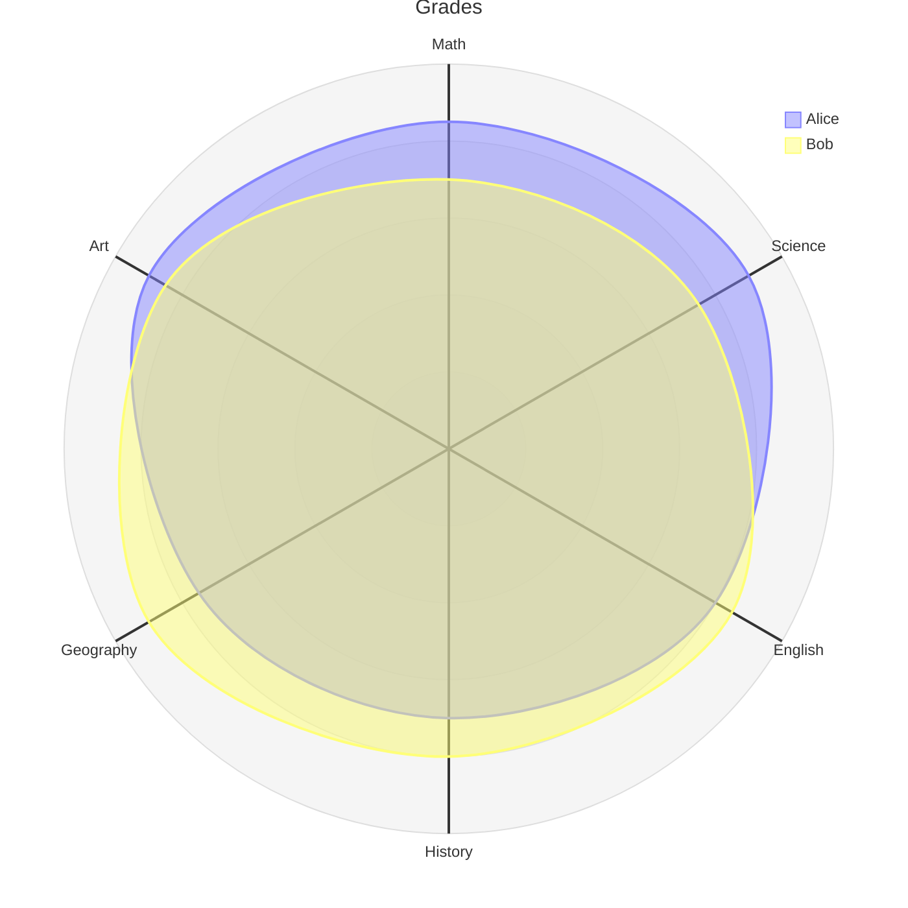
````

</details>
<!-- markdownlint-enable MD033 -->

## Cynefin framework

<!-- markdownlint-disable MD033 -->
<details>
<summary>Five complexity domains with decision models. New in Mermaid 11.16.</summary>

> [!important] Bundled Mermaid required
> This diagram type needs **Use bundled Mermaid 11** enabled.

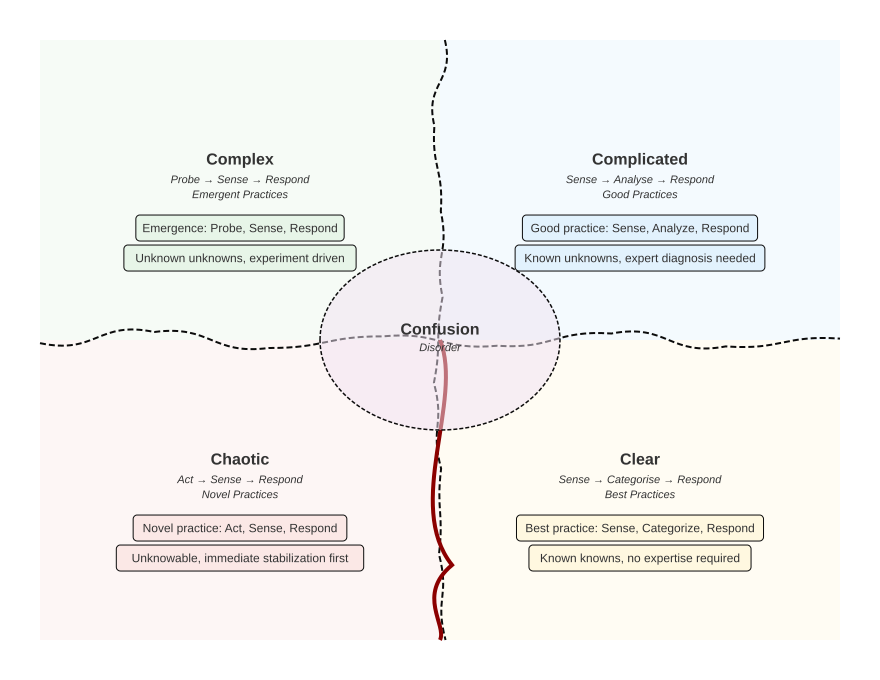

````markdown
```mermaid
---
config:
  look: handDrawn
  theme: base
---
cynefin-beta
    clear
        "Best practice: Sense, Categorize, Respond"
        "Known knowns, no expertise required"

    complicated
        "Good practice: Sense, Analyze, Respond"
        "Known unknowns, expert diagnosis needed"

    complex
        "Emergence: Probe, Sense, Respond"
        "Unknown unknowns, experiment driven"

    chaotic
        "Novel practice: Act, Sense, Respond"
        "Unknowable, immediate stabilization first"
```
````

</details>
<!-- markdownlint-enable MD033 -->

## Railroad diagram (IR)

<!-- markdownlint-disable MD033 -->
<details>
<summary>REST API route grammar using the IR constructor syntax. New in Mermaid 11.16.</summary>

> [!important] Bundled Mermaid required
> This diagram type needs **Use bundled Mermaid 11** enabled.

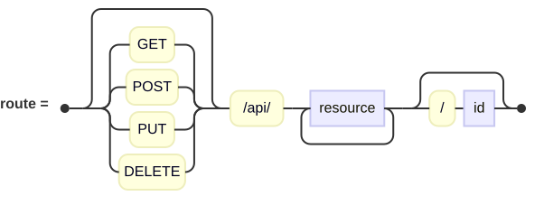

````markdown
```mermaid
railroad-beta
    title REST API Routes
    route = sequence(
        optional(choice(
            terminal("GET"),
            terminal("POST"),
            terminal("PUT"),
            terminal("DELETE"))),
        terminal("/api/"),
        oneOrMore(nonterminal("resource")),
        optional(sequence(
            terminal("/"),
            nonterminal("id"))));
```
````

</details>
<!-- markdownlint-enable MD033 -->

## Railroad diagram (EBNF)

<!-- markdownlint-disable MD033 -->
<details>
<summary>Arithmetic grammar in ISO 14977 EBNF notation. New in Mermaid 11.16.</summary>

> [!important] Bundled Mermaid required
> This diagram type needs **Use bundled Mermaid 11** enabled.

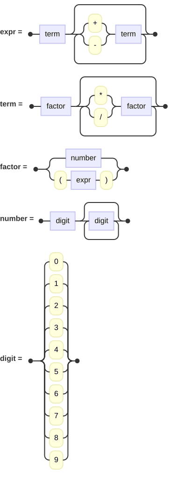

````markdown
```mermaid
railroad-ebnf-beta
    title Arithmetic Grammar
    expr = term { ("+" | "-") term };
    term = factor { ("*" | "/") factor };
    factor = number | "(" expr ")";
    number = digit { digit };
    digit = "0" | "1" | "2" | "3" | "4" | "5" | "6" | "7" | "8" | "9";
```
````

</details>
<!-- markdownlint-enable MD033 -->

## Railroad diagram (PEG)

<!-- markdownlint-disable MD033 -->
<details>
<summary>Calculator grammar in PEG notation. New in Mermaid 11.16.</summary>

> [!important] Bundled Mermaid required
> This diagram type needs **Use bundled Mermaid 11** enabled.

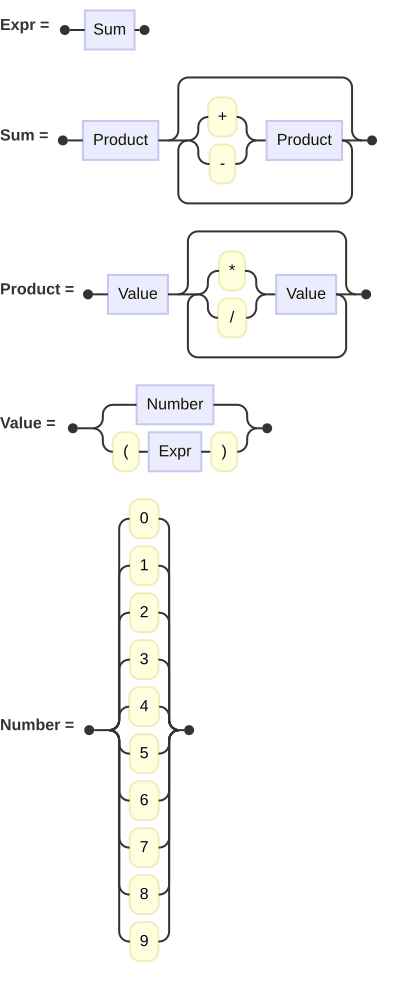

````markdown
```mermaid
railroad-peg-beta
    title PEG Calculator
    Expr <- Sum;
    Sum <- Product (("+" / "-") Product)*;
    Product <- Value (("*" / "/") Value)*;
    Value <- Number / "(" Expr ")";
    Number <- "0" / "1" / "2" / "3" / "4" / "5" / "6" / "7" / "8" / "9";
```
````

</details>
<!-- markdownlint-enable MD033 -->

## Pie chart

<!-- markdownlint-disable MD033 -->
<details>
<summary>Project time distribution with showData labels. New in Mermaid 11.16.</summary>


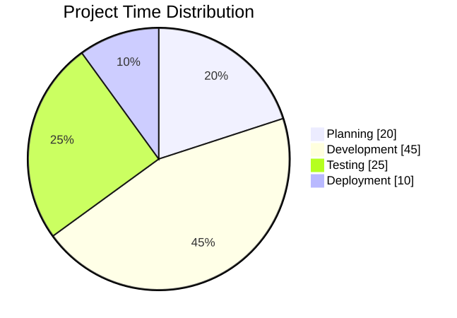

````markdown
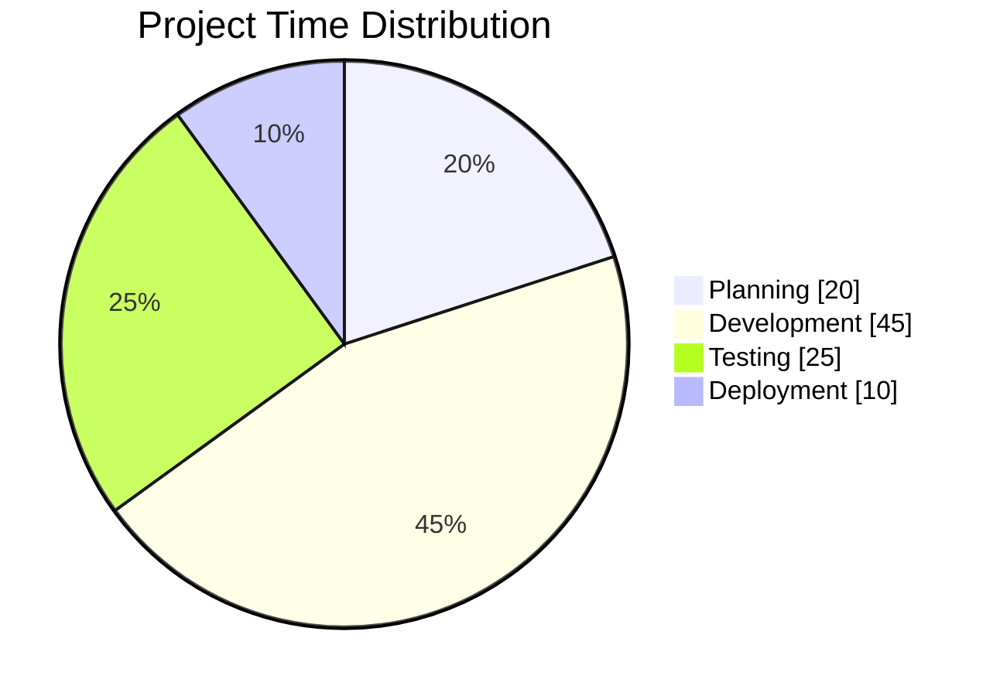
````

</details>
<!-- markdownlint-enable MD033 -->

## TreeView diagram

<!-- markdownlint-disable MD033 -->
<details>
<summary>Plugin project structure rendered as a file tree. New in Mermaid 11.16.</summary>

> [!important] Bundled Mermaid required
> This diagram type needs **Use bundled Mermaid 11** enabled.


````markdown

````

</details>
<!-- markdownlint-enable MD033 -->
## Notes

- Images are prerendered for portability. GitHub shows them even when it cannot run the plugin's Mermaid path.
- Source snippets come from `assets/prerendered-src/` and are rendered via `npm run render-svgs`.
- Newer diagram types need the bundled Mermaid runtime.
- Copy the Markdown files from [examples/](../examples/) into your vault to test live with the plugin.
