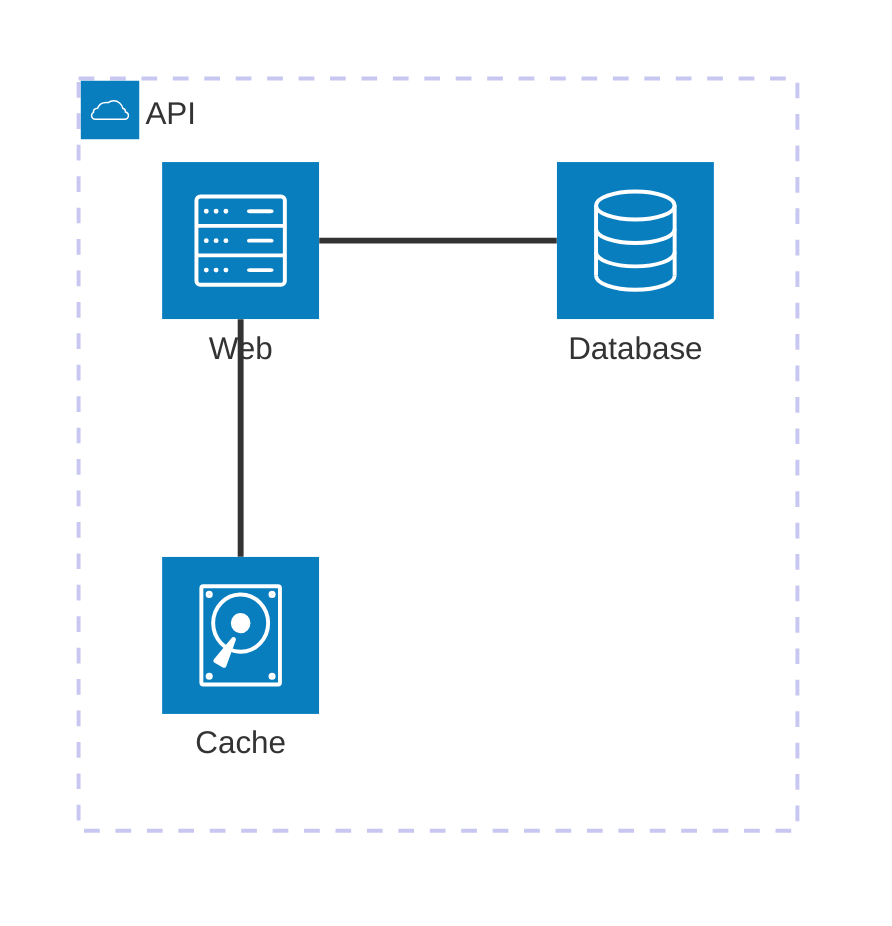
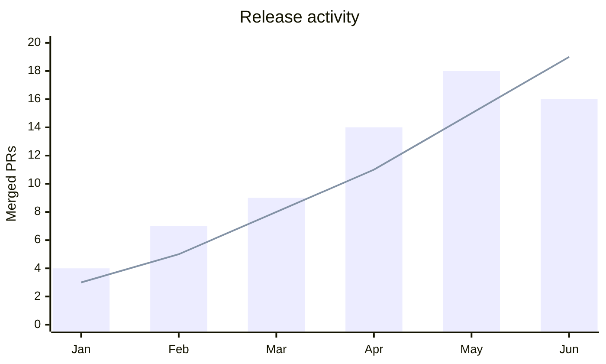
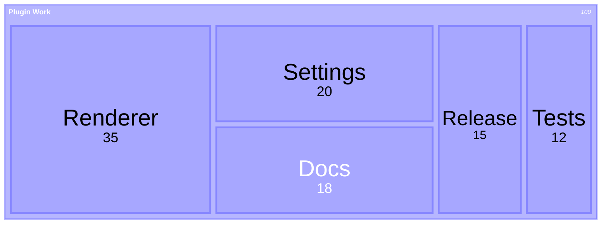
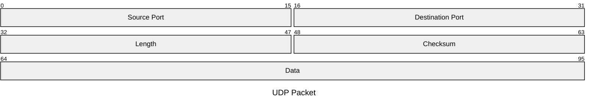
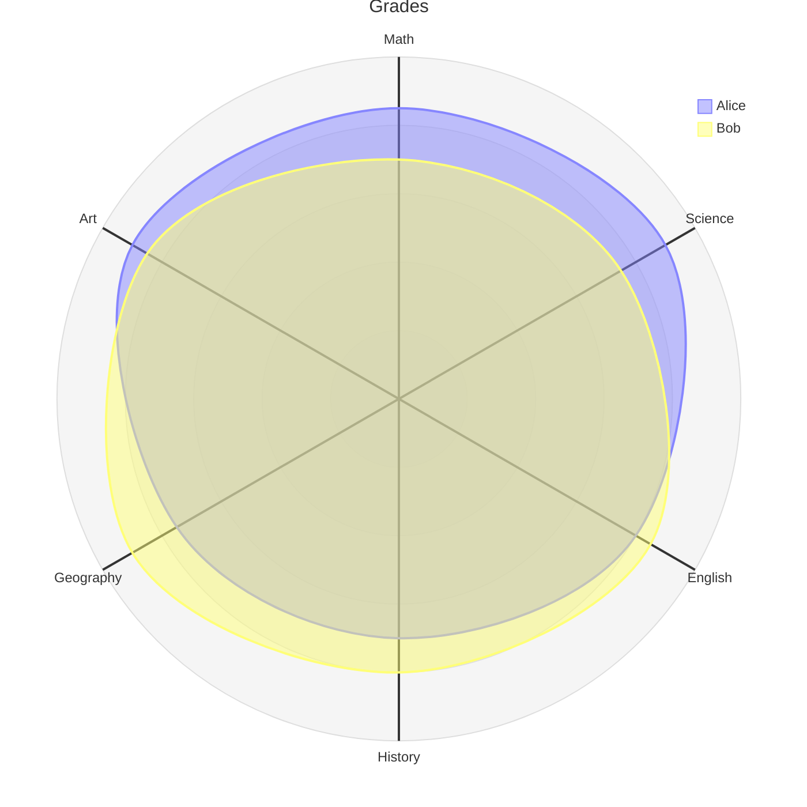

# Mermaid 11 example renders

Back to the main guide: [README](../README.md)

> [!info] What this page is for
> This page is a small showcase you can open in Obsidian or on GitHub when you want to demonstrate what the bundled Mermaid 11 renderer unlocks.
> [!important] This page exists because of the bundled Mermaid 11 toggle
> When **Use bundled Mermaid 11** is enabled, the plugin loads Mermaid `11.15.0` from the plugin instead of Obsidian's older bundled Mermaid.
> That is why these examples are worth showing off in the first place.
> Official Mermaid docs: [Mermaid introduction](https://mermaid.js.org/intro/)
> [!tip] Best way to view it
> The images on this page are prerendered for GitHub and plain Markdown viewers.
> To render the source snippets live in Obsidian, enable **Use bundled Mermaid 11** and keep the `%% elk %%` marker in the snippet.

## Architecture diagram

<!-- markdownlint-disable MD033 -->
<details>
<summary>Open architecture example</summary>


````markdown

````

</details>

## XY chart

<details>
<summary>Open XY chart example</summary>


````markdown

````

</details>

## Treemap diagram

<details>
<summary>Open treemap example</summary>


````markdown

````

</details>

## Packet diagram

<details>
<summary>Open packet example</summary>


````markdown

````

</details>

## Radar diagram

<details>
<summary>Open radar example</summary>


````markdown

````

</details>
<!-- markdownlint-enable MD033 -->

## Notes

- These are prerendered images for portability. GitHub can display the screenshots even when it cannot run the plugin-specific Mermaid path.
- The source snippets above keep `%% elk %%` on purpose because your plugin currently routes bundled Mermaid 11 through the marker path.
- Some of these diagram types are newer Mermaid 11 additions and may not work with Obsidian's older bundled Mermaid renderer.
- Official Mermaid docs: [Mermaid introduction](https://mermaid.js.org/intro/)
