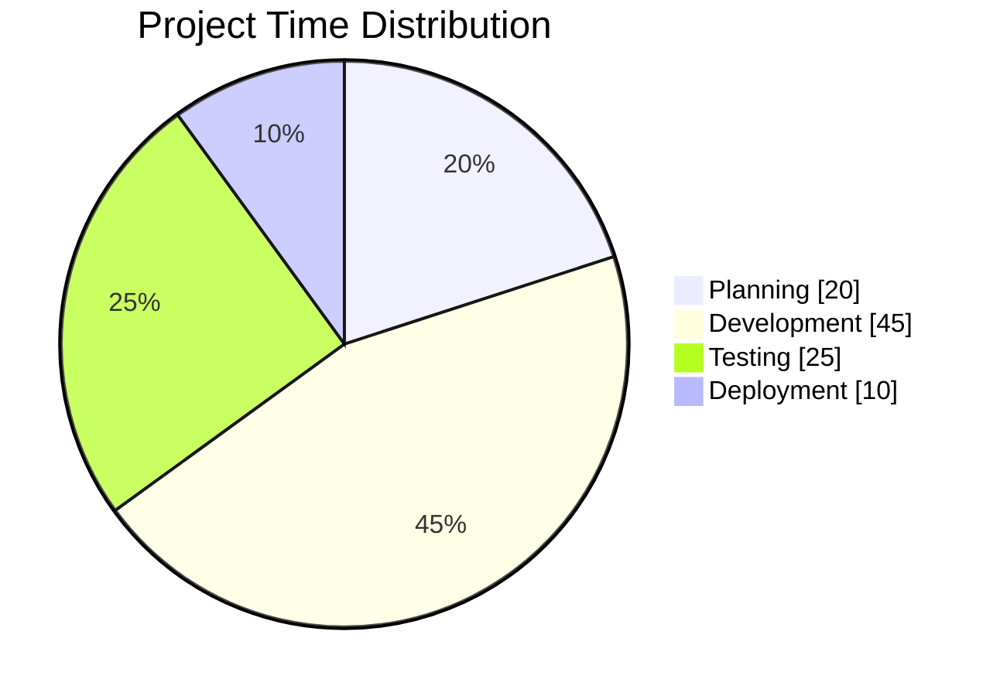
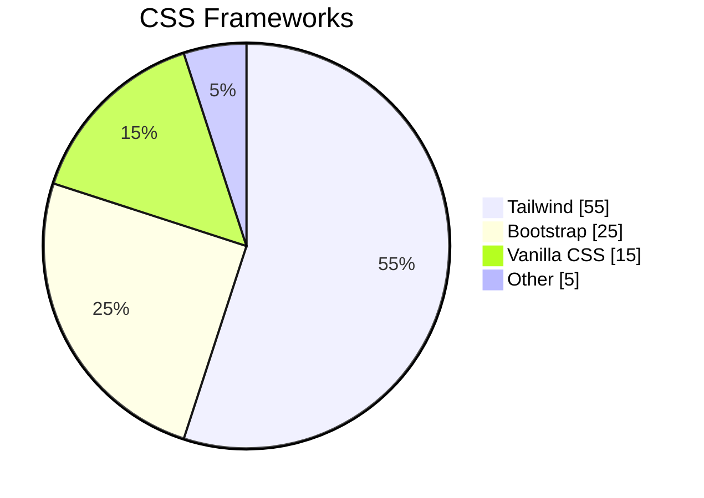
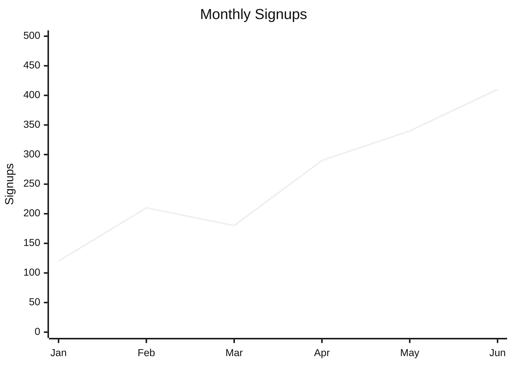
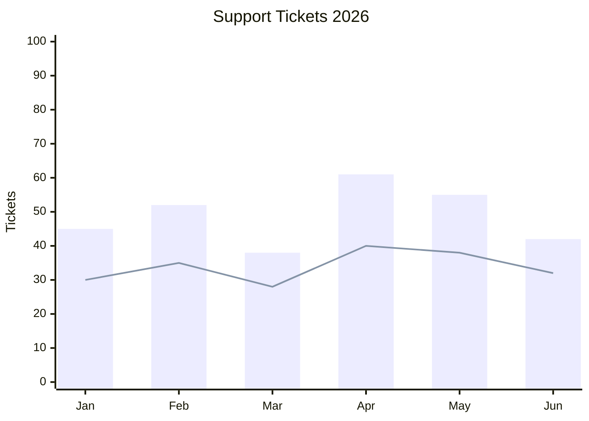

# Mermaid 11.16: Charts

> [!info] This file is best viewed with **Mermaid ELK Renderer** installed and enabled.
> `xychart-beta` needs **Use bundled Mermaid 11**. `pie` works with stock Obsidian Mermaid.

## Pie with showData (new)

`pie` does not support `layout`. Use `config:` only for `look` and `theme`:

---

## XYChart (beta)

`xychart-beta` is not a graph. `layout` is ignored, so the `%% elk %%` marker has no effect here.
