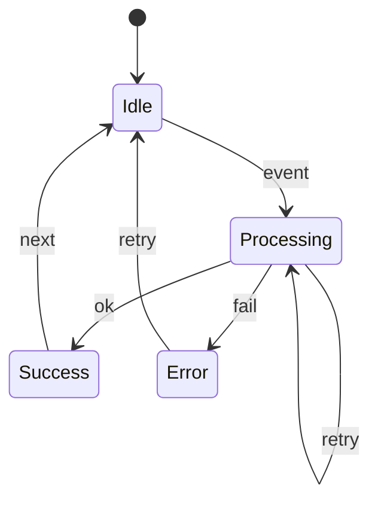
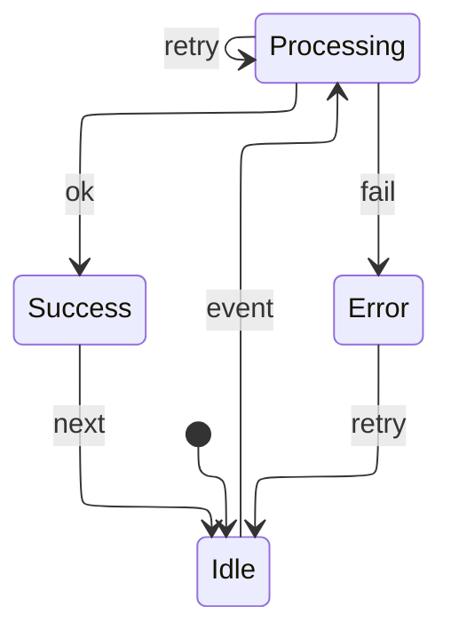
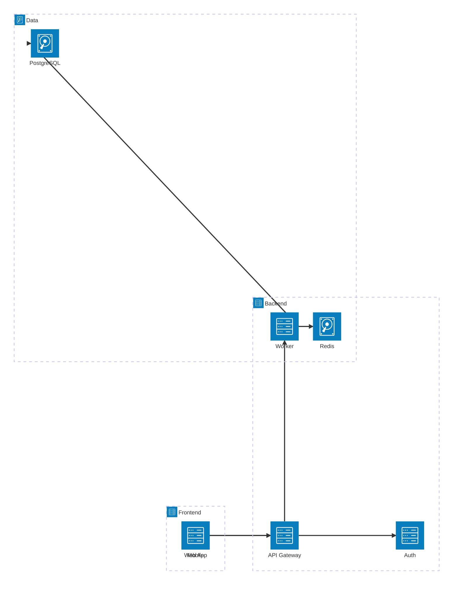
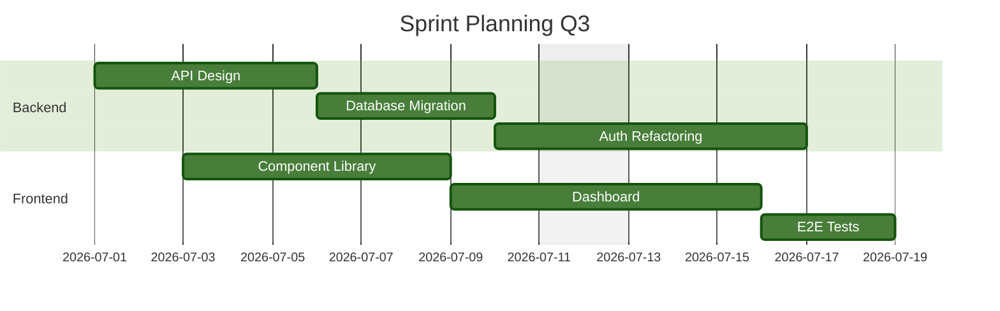

# Mermaid 11.16: ER, State, Architecture, Gantt, TreeView

> [!info] This file is best viewed with **Mermaid ELK Renderer** installed and enabled.
> `treeView-beta` needs **Use bundled Mermaid 11**. `erDiagram`, `stateDiagram`, `architecture-beta`, and `gantt` work with stock Obsidian Mermaid.

## ER diagram with optional attribute types (new)

Without `config:` (Mermaid uses dagre by default):

```mermaid
erDiagram
    CUSTOMER ||--o{ ORDER : places
    CUSTOMER {
        int id PK
        string name
        string? email
        string? phone
    }
    ORDER ||--|{ LINE-ITEM : contains
    ORDER {
        int id PK
        date orderedAt
        string? shippingAddress
    }
    LINE-ITEM {
        int id PK
        int quantity
        float? discount
    }
```

With `config:` for elk layout and handDrawn look:

```mermaid
---
config:
  layout: elk
  look: handDrawn
  theme: neutral
---
erDiagram
    CUSTOMER ||--o{ ORDER : places
    CUSTOMER {
        int id PK
        string name
        string? email
        string? phone
    }
    ORDER ||--|{ LINE-ITEM : contains
    ORDER {
        int id PK
        date orderedAt
        string? shippingAddress
    }
    LINE-ITEM {
        int id PK
        int quantity
        float? discount
    }
```

`config: layout: elk` works on all graph based types: `flowchart`, `classDiagram`, `erDiagram`, `stateDiagram`, `block-beta`.

---

## State diagram: dagre vs. elk

### dagre (default)



### elk



---

## Architecture diagram with groups and services (new)



`architecture-beta` is not a graph. `layout` has no effect, only `look` and `theme`.

---

## Gantt with multiple excludes (new)



`gantt` does not support `layout`. `config:` is only useful for `look` and `theme`.

---

## TreeView: file and directory structure (new)


Indentation defines the tree. Trailing `/` marks a directory. File extensions auto detect icons. Requires bundled Mermaid 11.
