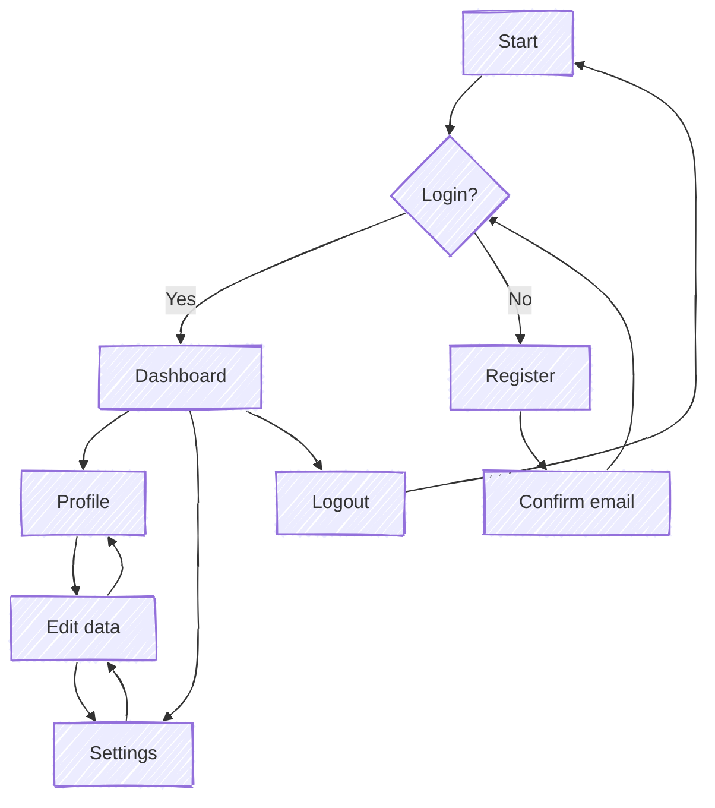
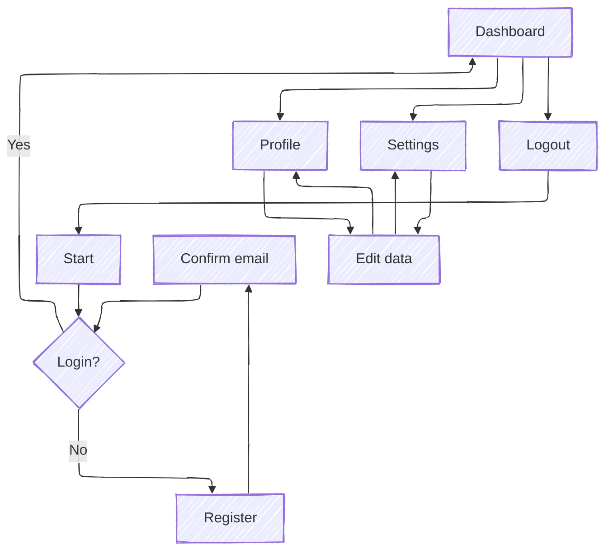
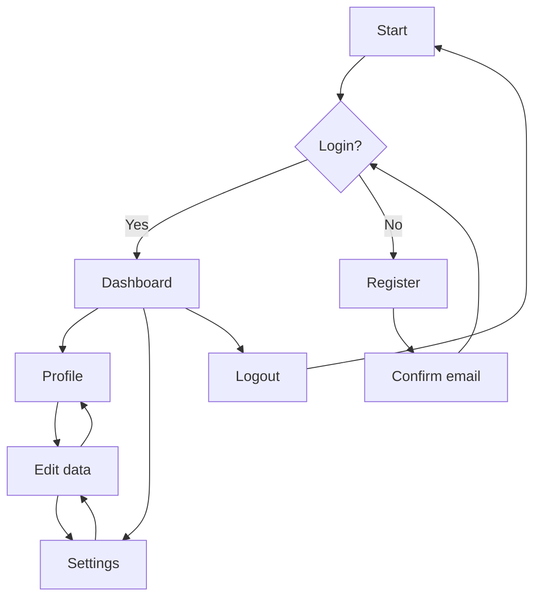
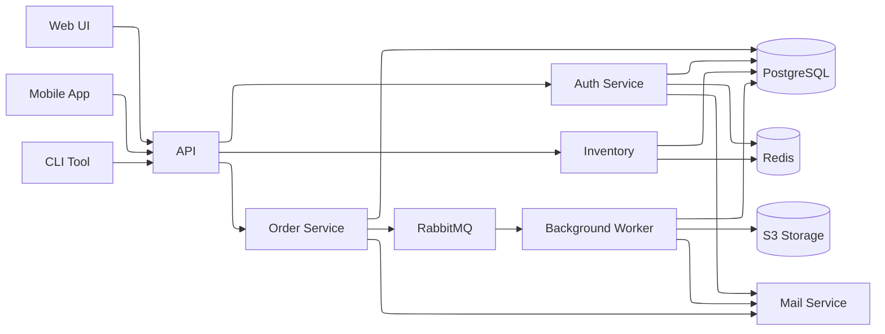
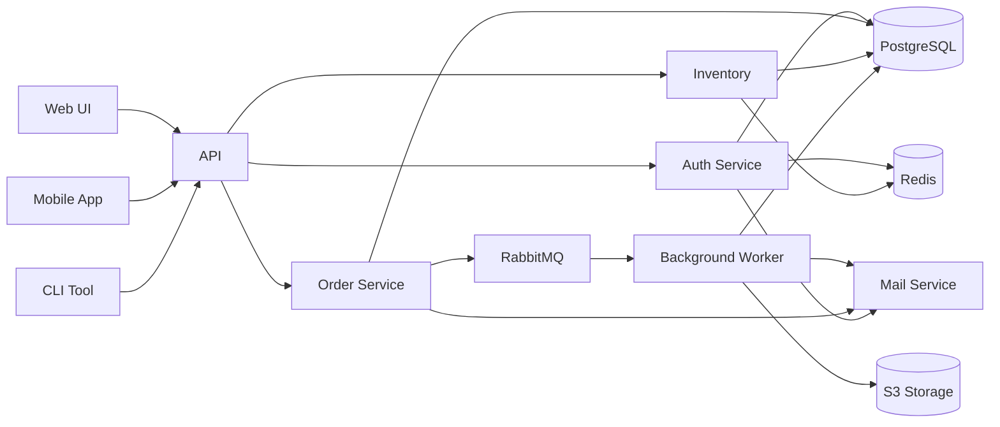

# Layout comparison: dagre vs. elk

> [!info] This file is best viewed with **Mermaid ELK Renderer** installed and enabled.
> `flowchart` and `stateDiagram` work without bundled Mermaid. For beta diagram types on other example pages, enable **Use bundled Mermaid 11**.

`config: layout:` works for **graph based diagram types**: `flowchart`, `classDiagram`, `erDiagram`, `stateDiagram`, `block-beta`.
Non graph types (`pie`, `gantt`, `xychart`, `sequence`, `mindmap`, `architecture`) ignore `layout`.

---

## dagre (Obsidian default)

---

## elk (explicit config)

---

## elk (via plugin marker)

Instead of an explicit `config:` block, use the `%% elk %%` marker. The plugin then injects `layout: "elk"` automatically:

---

## Complex microservice graph

dagre falls apart on dense cross connected graphs. Elk handles them fine.

Same example with dagre (the Obsidian default):

